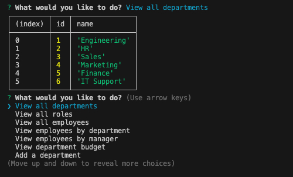
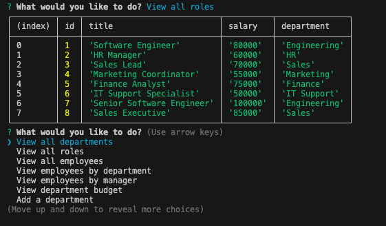
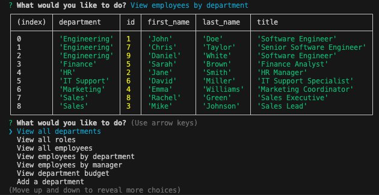
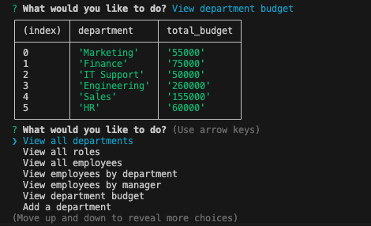

# Employee Management System


## Overview

A robust command-line application for managing employee data, built with Node.js and PostgreSQL. This system provides a comprehensive solution for businesses to track departments, roles, and employee information through an intuitive interface.

## Features Showcase

### Department Management
View all departments in your organization:



### Role Management
View all roles with their associated departments and salaries:



### Employee Management
View employees organized by department:



### Budget Management
Track department budgets and salary expenditures:



## Features

- **Department Management**
  - View all departments
  - Add new departments
  - Delete departments
  - View department budgets

- **Role Management**
  - View all roles
  - Add new roles
  - Delete roles
  - Associate roles with departments

- **Employee Management**
  - View all employees
  - Add new employees
  - Update employee roles
  - Update employee managers
  - Delete employees
  - View employees by department
  - View employees by manager

## Technology Stack

- **Backend**: Node.js
- **Database**: PostgreSQL
- **Dependencies**:
  - `pg`: PostgreSQL client for Node.js
  - `inquirer`: Interactive command-line interface
  - `dotenv`: Environment variable management

## Installation

1. **Clone the Repository**
   ```bash
   git clone https://github.com/rvrutan/employee-tracker.git
   cd employee-tracker
   ```

2. **Install Dependencies**
   ```bash
   npm install
   ```

3. **Database Setup**
   - Ensure PostgreSQL is installed and running
   - Create a `.env` file in the root directory with the following variables:
     ```
     DB_USER=your_username
     DB_PASSWORD=your_password
     DB_NAME=employees_db
     DB_HOST=localhost
     DB_PORT=5432
     ```
   - Initialize the database using the provided schema:
     ```bash
     psql -U your_username -f db/schema.sql
     ```
   - (Optional) Load sample data:
     ```bash
     psql -U your_username -d employees_db -f db/seeds.sql
     ```

4. **Start the Application**
   ```bash
   npm start
   ```

## Usage

The application provides an interactive menu system for managing your employee database:

1. Select an option from the main menu
2. Follow the prompts to perform the desired action
3. View results in a formatted table
4. Return to the main menu to perform additional actions

## Database Schema

The application uses a relational database structure with three main tables:

- **Department**: Stores department information
- **Role**: Defines job roles and their associated departments
- **Employee**: Tracks employee information and their relationships

## Contributing

Contributions are welcome! Please follow these steps:

1. Fork the repository
2. Create a feature branch (`git checkout -b feature/AmazingFeature`)
3. Commit your changes (`git commit -m 'Add some AmazingFeature'`)
4. Push to the branch (`git push origin feature/AmazingFeature`)
5. Open a Pull Request

## License

This project is licensed under the ISC License.

## Contact

- GitHub: [rvrutan](https://github.com/rvrutan)
- Email: rutanroni@gmail.com

## Acknowledgments

- The open-source community for their invaluable tools and resources
